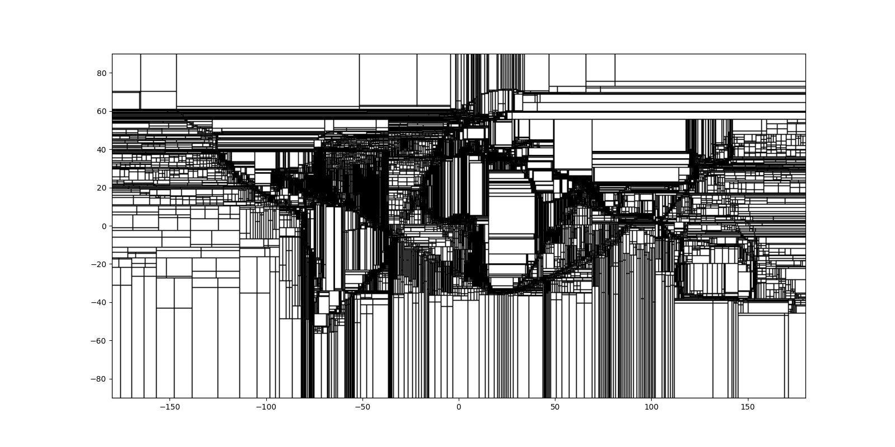
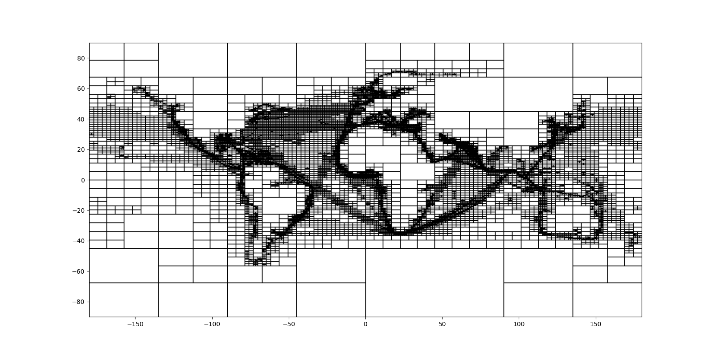

# Quad-Tree

The Quad-Tree is an umbrella term for popular spatial indexes that subdivide the space into quadrants.
I was not happy with the C++ implementations, so I wrote my own. 
It supports static/dynamic data and common spatial queries. 
In addition, the index can be constructed (and updated) according to two different strategies.
The code also provides statistics about the index (e.g., height, size in MB) and about the queries (e.g., execution time, IO cost).

## The implementation supports:
1. Two partitioning methods.
1. Bulk loading.
1. Dynamic insertions.
1. Range queries.
1. K nearest neighbor queries.

## How to compile
    g++ main.cpp QuadTree.cpp Input.cpp

## How to run
    ./quadTree dataFile limit queryFile

* *dataFile*: Denotes the dataset to be bulkloaded. Check *dataExample.txt* for format.
* *limit*: The number of records to read from *dataFile*. *-1* bulkloads the entire file.
* *queryFile*: Denotes the file with the queries to be executed. Check *queryExample.txt* for format.

## Data file format
        id x y
        id x y
        ...
Every record should be in a different row. Do not use a header.

For an example see *dataExample.txt*. 

Disclaimer: Your data file must have more records than the leaf node capacity.

## Query file format
There are four *type* of queries. The general format is the following:

        type x_low y_low x_high y_high info
        type x_low y_low info
        ...
        
* Type *r* denotes a range query. It is the only type that needs the upper right corner (i.e., x_high y_high). Info denotes the size of the range per axis.
* Type *k* denotes a kNN query. Info denotes k.
* Type *i* denotes an insertion. Info is the id of the new point.
* Type *l* denotes log. It prints statistics about the queries and the tree.

For an example see *queryExample.txt*. 

## Partitioning methods
The code supports two splitting strategies to handle node overflows.
1. *Optimized Point-Quad-Tree*: splits the bucket on the median point. [^2]
1. *Point-Region-Quad-Tree*: divides the bucket into equal sized regions. [^1]

You can change the method used in *def.h*.

The figures visualize partitions (i.e., leaves) for both strategies. *Optimized Point Split* is left and *Region Split* right. The dataset used is 1 million points of ships geolocations.

 

## Index parameters
The index parameters are set in *def.h*.

*CAPACITY*: sets the maximum number of points in a leaf node. I have only experimented with values greater than *1* (i.e., bucket Quad-Trees).

*POINT_SPLIT*: picks the partitioning algorithm. If *true*, it uses the optimized point split strategy, while if *false* it creates equal regions.

## References
[^1]: Hanan Samet. 1989. Hierarchical Spatial Data Structures. InDesign and Imple-mentation of Large Spatial Databases, First Symposium SSD’89, Santa Barbara,California, USA, July 17/18, 1989, Proceedings (Lecture Notes in Computer Science,Vol. 409), Alejandro P. Buchmann, Oliver Günther, Terence R. Smith, and Y.-F.Wang (Eds.). Springer, 193–212.  https://doi.org/10.1007/3-540-52208-5_28
[^2]: Raphael A. Finkel and Jon Louis Bentley. 1974. Quad Trees: A Data Structure forRetrieval on Composite Keys.Acta Informatica4 (1974), 1–9.  https://doi.org/10.1007/BF00288933
